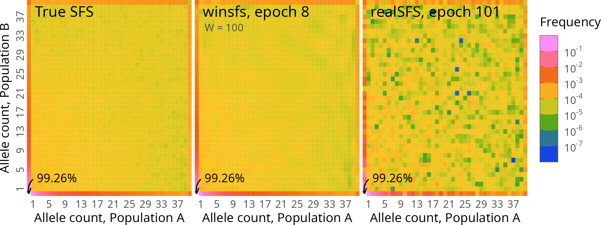
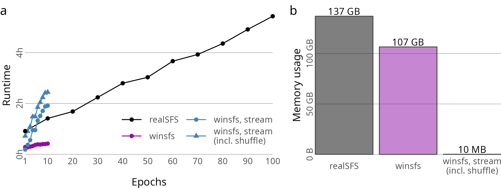

# winsfs

[](https://github.com/malthesr/winsfs/actions)

**`winsfs`** is a tool for inference of the site frequency spectrum ("SFS") from low-depth sequencing data. The associated manuscript is published in [Genetics][article], and a pre-print is available on [bioRxiv][bioarxiv].

In overview, `winsfs` iteratively estimates the SFS on smaller blocks of data conditional on the current estimate, and then updates the estimate as the average over a window of such block estimates.

## Contents

1. [Quickstart](#quickstart)
    1. [Coming from realSFS](#coming-from-realsfs)
2. [Motivation](#motivation)
3. [Usage](#usage)
    1. [Input](#input)
    2. [Estimation](#estimation)
    3. [Output](#output)
    4. [Streaming](#streaming)
4. [Utilities](#utilities)
    1. [View](#view)
5. [Installation](#installation)
    1. [Latest release](#latest-release)
    1. [Current git](#current-git)

## Quickstart

Assuming `winsfs` has been [installed](#installation) and SAF files have already been made, default estimation can be run in one or two dimensions:

```shell
winsfs $saf1 > $sfs
winsfs $saf1 $saf2 > $sfs
```

Here, `$saf1`/`$saf2` is the path to any SAF member file (i.e. some file with extension `.saf.idx`, `.saf.pos.gz`, or `.saf.gz`) and `$sfs` is where you wish to write the finished SFS estimate.

Note that the estimated SFS is written to stdout, so make sure to redirect as desired.

The [Usage](#usage) section below goes into more detail. See also `winsfs -h` (short help) or `winsfs --help` long help for an overview of options.

### Coming from realSFS

If you're already familiar with the `realSFS` program from [ANGSD][angsd], usage of `winsfs` should be straightforward. The input format is the same, so in

```shell
realSFS $saf1 > $sfs
realSFS $saf1 $saf2 > $sfs
```

simply replace `realSFS` by `winsfs`:

```shell
winsfs $saf1 > $sfs
winsfs $saf1 $saf2 > $sfs
```

The command-line options to `winsfs` differ from those available in `realSFS`, but should not be necessary in general. See more in the [Usage](#usage) section below. By default, `winsfs` is quiet, unlike `realSFS`. You can add a `-v` or `-vv` flag to print some information to stderr while running.

Likewise, the output format should be familiar: `winsfs` outputs two lines, where the second is the same format as the `realSFS` output; the first is a small header line with some information about the shape of the SFS. See [Output](#output) for more details.

## Motivation

Estimating the SFS from called genotypes is typically fairly straight-forward. However, it has been [shown][han2014] that estimating the SFS from genotypes using low-depth sequencing data creates significant bias, which propagates to downstream inference. As a very rough rule of thumb, this is true up until around 10x coverage.

`winsfs` is a method for addressing this issue by inferring the SFS from genotype likelihoods using an stochastic optimisation algorithm. Some of its benefits are highlighted here; for a full discussion of the method and the various ways it has been evaluated, please see the [associated article][article].



The figure above shows the two-dimensional SFS estimated by `winsfs` (middle) with default parameters compared to the known truth (left) for simulated 2x data from two samples of 20 individuals. `winsfs` reports convergence after 8 passes through the data ("epochs") and accurately recovers the true spectrum. In comparison, `realSFS` (right), which is the most widely used current method, takes 101 epochs before converging and presents a "checkerboard" pattern in the interior of the SFS. By averaging over smaller block estimates of the spectrum, `winsfs` has an implicitly smoothing effect on the spectrum, which tends to improve inference when a large number of parameters must be estimated with little available information.

In general, `winsfs` requires very few epochs to converge: almost always less than 10, and typically only 2-5. In addition, the implementation aims to be efficient. The figure below shows the computational requirements of `winsfs` (again compared to `realSFS`) used for estimating the two-dimensional SFS of approximately 0.6B sites of low-quality, real-world data.



The figure shows `winsfs` in the main usage mode, but also the so-called "streaming mode". Since only a few passes over the input data are required, it is possible to run `winsfs` without reading data into RAM. This increases the run-time, but significantly decreases the memory requirements. More details are available in the [Streaming](#streaming) section.

## Usage

### Input

The input for `winsfs` is so-called "site allele frequency" ("SAF") likelihoods calculated for each input population separately. It is possible to think of SAF likelihoods as the generalisation of genotype likelihoods from one individual to a population. The [`winsfs` article][article] provides some theoretical background, and you can also look at the [original article about SAF likelihoods][nielsen2012] for more information.

SAF likelihoods are stored in SAF files from the [ANGSD][angsd] software suite. SAF files are split across three separate files that end in `.saf.idx`, `.saf.pos.gz`, or `.saf.gz`. In the simplest case, SAF files can be generated from a list of BAM files for a population:

```shell
angsd -b $bamlist -anc $ref -out $prefix -dosaf 1 -gl 2
```

where `$bamlist` is the list of BAMs, `$ref` is a FASTA reference, and `$prefix` determines the output location (i.e. `-out abc` will create SAF files `abc.saf.idx`, `abc.saf.pos.gz`, and `abc.saf.gz`).

In general, however, it is advisable to filter the input data before SAF creation. Which filters to use will depend on the kind of data you have. For low-depth whole-genome short-read sequencing, [this article][pecnerova2021] describes a good filtering workflow (cf. "strictref" filter) and has [code available][leopard-git].

For the purposes of trying out `winsfs`, some test SAF files are available in this repository and can be downloaded by running:

```shell
wget -q https://github.com/malthesr/winsfs/raw/main/winsfs-cli/tests/data/{A,B}.saf.{idx,gz,pos.gz}
```

This will download two SAF files (e.g. six files total) `{A,B}.saf.{idx,gz,pos.gz}` to the current working directory. We will use these files below for illustration.

If you wish to run joint SFS estimation for multiple populations, note that it is **not** required that these contain the same sites. `winsfs` will automatically intersect the input to get only sites present in all populations. The flip-side, of course, is that you should be aware that non-intersecting sites are ignored.

### Estimation

To run `winsfs` with default parameters for a single population (here the A population from above), simply run:

```shell
winsfs A.saf.idx > A.sfs
```

For two populations, simply add another SAF file member path (here from the B population):

```shell
winsfs A.saf.idx B.saf.idx > A-B.sfs
```

`winsfs` will run quietly until finished and print the estimated SFS to stdout, redirecting to `A.sfs` or `A-B.sfs` in the above examples. Note that for genome-scale data, this could take a while, especially in multiple dimensions, so you may wish to run in the background or in a detachable terminal multiplexer. Also note that this will read the contents of the SAF file(s) into RAM: depending on the input file size, this may require a significant amount of RAM. For a sense of scale, in the benchmark in the `winsfs` article, SFS estimation for a single population with 12 individuals approx 0.6B sites required 63GB of RAM. If this is not an option for you, see the [streaming section](#streaming) below.

By default, `winsfs` is quiet and prints nothing to the terminal. You may wish to add `-v` to get a bit of information about progress, or `-vv` to see more information, including how the SFS looks after each epoch of optimisation. In addition, `winsfs` can be made to run faster by increasing the number of threads using `-t`/`--threads` if more than the default four are available. Finally, it is possible to set a seed for `winsfs` using `-s`/`--seed` for reproducibility.

It is also possible to tweak the hyperparameters of `winsfs` (using the `-b`/`--block-size`, `-B`/`--blocks`, and `-w`/`--window-size` flags), but this is **not** generally recommended. Based on our experiences, the defaults should work well for a wide range of inputs. Likewise, it is possible to change the stopping criteria (`-l`/`--tolerance` and/or `--max-epochs`), but this should likewise not be necessary.

These and more options can also be seen by running `winsfs -h` (for a short description of each flag) or `winsfs --help` (for a longer description).

### Output

The output format consists of two lines. The first is a header lines giving the shape of the SFS. The second line is the SFS itself printed in flat, row-major (also known as C-major) format.

For example, running:

```shell
winsfs --seed 1 A.saf.idx B.saf.idx
```

results in the following output:

```
#SHAPE=<11/13>
218928.885549 176.078359 121.493226 44.881154 34.052637 24.050088 1.685736 0.558335 3.975430 0.000001 0.000372 9.115605 0.000000 225.017010 0.585755 0.000000 0.000000 1.320827 0.444349 0.000000 0.000000 2.239774 0.077091 0.000000 0.000000 0.000000 91.941164 1.249722 0.000000 0.000000 0.172935 0.000004 0.000000 0.000000 6.521391 2.827981 0.069702 0.000000 0.000000 16.983798 0.001461 15.931486 0.423076 0.101538 0.167897 0.000009 2.704495 0.000154 0.000000 0.000000 0.000000 0.000000 74.574485 0.000000 6.460728 3.276808 0.001221 0.012219 0.005795 19.987612 0.000010 0.000000 0.000000 4.481677 0.000000 19.241780 0.000000 0.000000 0.000038 0.000002 0.003287 0.030075 0.002316 0.000023 0.000003 2.246225 0.000120 3.272240 0.850840 0.000000 0.000001 4.961961 3.597735 0.728045 0.064433 0.000023 0.137432 11.529768 9.486486 0.000000 0.060813 19.449133 0.000000 0.845622 8.274797 0.000009 0.000000 0.000000 0.000000 0.000000 0.000000 0.000000 0.000000 8.551725 0.023502 0.000000 0.774367 0.006260 0.092155 2.469819 0.000243 0.000000 1.889402 0.000000 0.000000 0.000000 6.180176 0.000000 0.000000 0.000000 5.095501 7.922833 14.515402 0.000000 0.000000 0.000000 0.000000 0.000161 0.000000 1.554942 0.000000 0.000000 0.000000 0.000000 0.000000 0.000000 0.000000 0.000000 0.000000 0.000000 14.549382 0.000000 29.232257
```

The header line tells us that this SFS has shape 11/13, i.e. it can be read as a matrix with 11 rows and 13 columns. Since the format is row-major, the first 13 values in the second line corresponds to the first row of this matrix; then the next 13 values correspond to the second row, and so on.

Note also that the output SFS is unnormalised: the values in the SFS sums to the total number of (intersecting) input sites. Hence, to get the SFS on probability scale, you can simply divide each value by the sum.

See the [View](#view) section for normalising or folding the output spectrum, or for conversion to other formats.

### Streaming

It is possible to run `winsfs` in so-called "streaming mode". Unlike the main usage mode described above, streaming mode uses only a trivial amount of RAM (a couple of MB, say), but this comes at the expense of disk space usage and longer run-time. If you have the RAM required to run in the main usage mode, doing so will be more convenient.

To run in streaming mode, an intermediate file must be produced. Briefly, this is required to (jointly) shuffle around the input sites to break linkage disequilibrium patterns. The `winsfs shuffle` sub-command is used for this preparatory step. With a single population:

```shell
winsfs shuffle --output A.saf.shuf A.saf.idx
```

This will write the intermediate, shuffled file to `A.saf.shuf`. For technical reasons, this file cannot be written to stdout, so the output file destination must be provided via the `-o`/`--output` flag.

Using this file, it is possible to run `winsfs` as normal:

```shell
winsfs A.saf.shuf > A.sfs
```

This will automatically run in streaming mode based on the input file format. The usual flags and options apply (see [above](#estimation)), except that streaming mode can only run on a single thread.

Running streaming mode in two dimensions is similar:

```shell
winsfs shuffle --output A-B.saf.shuf A.saf.idx B.saf.idx
winsfs A-B.saf.shuf > A-B.sfs
```

Note, however, that the input to the `winsfs` in the second line is only a single file now, since populations A and B have been jointly shuffled into the `A-B.saf.shuf` file. This is by necessity: it is **not** possible to run `winsfs shuffle` for each of the A and B populations separately and then run two-dimensional estimation from the results of the output.

## Utilities

Apart from the main tools to estimate the SFS, `winsfs` contains some subcommand to work with frequency spectra in general. Note that the following can be used whether or not the spectrum has been created by `winsfs`.

### View

The `winsfs view` subcommand can fold the SFS, normalise the SFS, and convert it between formats. We can create an SFS for demonstration:

```shell
winsfs --seed 1 A.saf.idx > A.sfs
cat A.sfs
```
```
#SHAPE=<11>
219338.725607 234.737776 95.505146 32.339889 124.751169 2.732751 71.741684 18.504599 0.004084 37.070165 43.887130
```

We can normalise the SFS with the `-n`/`--normalise` flag:

```
winsfs view --normalise A.sfs
```
```
#SHAPE=<11>
0.996994 0.001067 0.000434 0.000147 0.000567 0.000012 0.000326 0.000084 0.000000 0.000169 0.000199
```

Or fold it using `-f`/`--fold`:

```
winsfs view --fold A.sfs
```
```
#SHAPE=<11>
219382.612737 271.807941 95.509230 50.844488 196.492853 2.732751 0.000000 0.000000 0.000000 0.000000 0.000000
```

`winsfs view` also supports conversion between the standard plain text format and the numpy `npy` binary format using the `-o`/`--output-format` flag, which may be helpful for downstream processing of the SFS in python.

## Installation

A recent Rust toolchain is required to install `winsfs`. Currently, the Rust toolchain can be installed by running:

```shell
curl --proto '=https' --tlsv1.2 -sSf https://sh.rustup.rs | sh
source $HOME/.cargo/env
```

See [instructions][rust-installation] for more details.

Once the Rust toolchain is installed (see above), the latest `winsfs` release can be installed using `cargo`:

### Latest release

```shell
cargo install winsfs-cli
```

This will install the `winsfs` binary to `$HOME/.cargo/bin` by default, which should be in the `$PATH` after installing `cargo`. Alternatively:

```shell
cargo install winsfs-cli --root $HOME
```

Will install to `$HOME/bin`.

### Current git

The latest git version may include more (potentially experimental) features, and can be installed using:

```shell
cargo install --git https://github.com/malthesr/winsfs
```

[bioarxiv]: https://www.biorxiv.org/content/10.1101/2022.05.24.493190
[article]: https://doi.org/10.1093/genetics/iyac148
[han2014]: https://academic.oup.com/mbe/article/31/3/723/1007998
[nielsen2012]: https://journals.plos.org/plosone/article?id=10.1371/journal.pone.0037558
[pecnerova2021]: https://www.sciencedirect.com/science/article/pii/S0960982221001299
[leopard-git]: https://github.com/KHanghoj/leopardpaper
[angsd]: https://github.com/ANGSD/angsd/
[rust-installation]: https://www.rust-lang.org/tools/install
